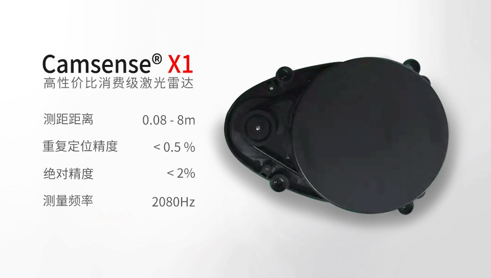
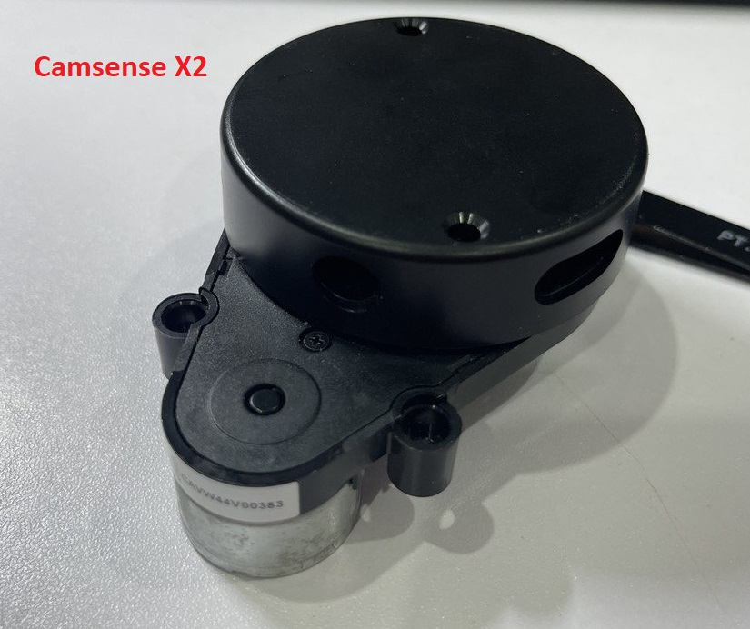
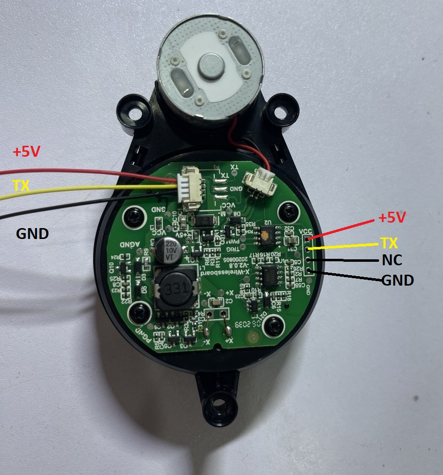
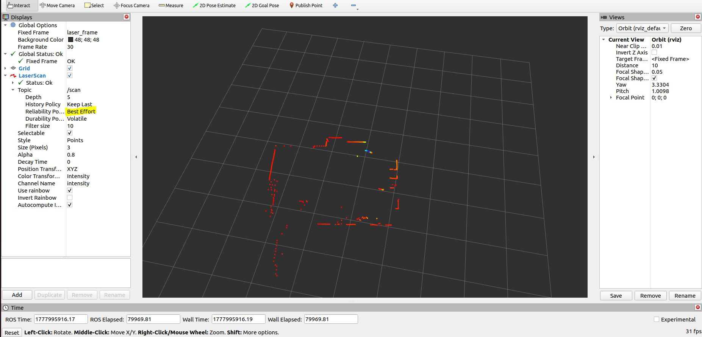

# 1. Hướng dẫn kết nối Camsense X1/X2

Camsense X1/X2 là lidar giá rẻ thường được trang bị trên các dòng robot hút bụi nội địa của Trung Quốc như 360, Midea,...

Về thông số kỹ thuật thì X2 là bản nâng cấp nhẹ của X1 với tần số quét cao hơn (khoảng 3kHz so với 2.08kHz của X1).

Vì vậy driver này dùng được cho cả X1 và X2 (và có thể dùng cho cả X1M/X2M - bản mid-range của X1/X2, tuy nhiên tác giả chưa điều kiện test thử)

 

Cả hai đều sử dụng giao tiếp UART (với baudrate cố định 115200-8-N-1) để gửi dữ liệu liên tục qua chân Tx.

Có thể kết nối trực tiếp với MCU (STM32, ESP32, PIC, AVR,...) hoặc với PC hoặc máy tính nhúng SBC (như Jetson, Raspberry pi, ...) thông qua module chuyển đồi USB-UART theo sơ đồ như sau:
| Camsense X1/X2 Pin  | MCU pin                   |  Module chuyển đổi USB-UART
| ------------------- | ------------------------- | --------------------------- |
| +5V                 | Nối tới nguồn +5V         | +5V của module
| TX                  | Nối tới chân RX của MCU   | RXD của module
| GND                 | Nối tới mass chung (GND)  | GND của module

Tuy nhiên trong khuôn khổ repo này chỉ đề cập đến việc kết nối Camsense X1/X2 với PC hoặc máy tính nhúng SBC (như Jetson, Raspberry pi, ...)

***Chú ý***

*Nên sử dụng module chuyển đổi USB-UART "xịn" như CP2102, FTDI232. Tuy nhiên cũng có thể dùng CH340 giá rẻ và rất phổ biến, có thể tìm mua với giá dao động từ 15-40k từ các shop linh kiện điện từ hoặc sàn thương mại điện tử. Trong bài viết này minh họa sử dụng với module FTDI232.*

## 1.1. Kết nối Camsense X1 với PC/SBC

Có thể kết nối Camsense X1 tới SBC (qua module chuyển đổi USB-UART) bằng 2 cách:
- thông qua connector HY-2.0 3P (3 chân màu trắng)
- Thông qua hàng header 6pin 2.54


## 1.2. Kết nối Camsense X2 với PC/SBC

Có thể kết nối Camsense X1 tới SBC  (qua module chuyển đổi USB-UART) bằng 2 cách như hình minh họa dưới đây:
- thông qua connector JST1.25 3P (có tặng kèm)
- Thông qua hàng header 4pin 2.54 rất phổ biến



# 2. Hướng dẫn cài driver ROS2 cho Camsense X1/X2

Sau khi kết nối Lidar tới SBC, hãy thử cắm module chuyển đổi USB-UART vào cổng USB của PC hoặc SBC, nếu thấy Lidar quay đều và PC/SBC nhận cổng chuyển đổi (thường là /dev/ttyUSB0) hãy tiếp tục cài đặt và sử dụng driver ROS2 theo các bước dưới đây:

## 2.1. Clone hclidar_driver_ros2

Clone driver hclidar_driver_ros2 từ github:

   ```
   git clone git@github.com:manhbt/hclidar_driver_ros2.git ros2_ws/src/hclidar_driver_ros2
   ```

***Lưu ý:***

Đối với các phiên bản Ubuntu cũ hơn, bạn cần chọn đúng tag/nhánh tương ứng.
Ví dụ: nếu muốn dùng với Ubuntu 18.04:
   ```
   git clone -b v18.04 git@github.com:manhbt/hclidar_driver_ros2.git ros2_ws/src/hclidar_driver_ros2
   ```

## 2.2. Build driver hclidar_driver_ros2:

   ```
   cd ros2_ws
   colcon build --symlink-install
   ```
***Lưu ý: ***

Nếu PC/SBC của bạn chưa cài colcon thì hãy cài đặt như sau:
   ```
   sudo apt update
   sudo apt install python3-colcon-common-extensions
   ```

## 2.3. Cài đặt môi trường:

   ```
   source ./install/setup.bash
   ```

***Lưu ý:***

Bạn có thể thêm biến môi trường workspace để chúng sẽ được tự động thêm vào mỗi khi mở terminal mới:

   ```
   echo "source ~/ros2_ws/install/setup.bash" >> ~/.bashrc
   source ~/.bashrc
   ```

## 2.4. Kiểm tra

Để xác nhận đường dẫn gói đã được thiết lập, dùng lệnh printenv với `grep -i ROS`:
   ```
   $ printenv | grep -i ROS
   ```
Bạn sẽ thấy kết quả tương tự:
   ```
   OLDPWD=/home/manhbt/ros2_ws/install
   ```

## Cấu hình LiDAR [tham số](params/hclidar.yaml)
```
hclidar_driver_ros2_node:
  ros__parameters:
    frame_id: laser_frame
	lidar_model: "X1"
	port: /dev/ttyUSB0
    ignore_array: ""
    baudrate: 115200
    lidar_type: 1
    device_type: 0
    sample_rate: 9
    abnormal_check_count: 4
    resolution_fixed: true
    reversion: true
    inverted: true
    auto_reconnect: true
    isSingleChannel: false
    intensity: false
    support_motor_dtr: false
    angle_max: 3.1415926
    angle_min: -3.1415926
    range_max: 8.0
    range_min: 0.08
    frequency: 10.0
    invalid_range_is_inf: false
```

# 3. Chạy hclidar_driver_ros2

#### Đảm bảo bạn có quyền đọc/ghi trên cổng serial (/dev/ttyUSB0 chẳng hạn) trước khi khởi chạy driver lidar
   ```
   sudo chmod 666 /dev/ttyUSB0
   ```

### Cú pháp chung khi chạy hclidar_driver_ros2 bằng launch file

Cú pháp lệnh:

 `ros2 launch hclidar_driver_ros2 [tên launch file].py`

## 3.1. Khởi động lidar driver.
   ```
   ros2 launch hclidar_driver_ros2 hclidar_launch.py
   ```
   hoặc

   ```
   launch $(ros2 pkg prefix hclidar_driver_ros2)/share/hclidar_driver_ros2/launch/hclidar.py
   ```
## 3.2. Khởi động driver và mở RVIZ2
   ```
   ros2 launch hclidar_driver_ros2 hclidar_launch_rviz.py
   ```

***Lưu ý:***

Vì đây là bản driver được port từ driver ROS1 nên cần chỉnh lại thông số Reliability Policy sang Best Effort để xem được scan data trên Rviz như hình minh họa sau:



## 3.3. Xem dữ liệu topic scan
   ```
   ros2 topic echo /scan
   ```

## Giới thiệu các launch file

Driver cung cấp nhiều tùy chọn thông qua các launch file khác nhau. Thư mục chứa launch file là `"ros2_ws/src/hclidar_driver_ros2/launch"`. Danh sách tất cả launch file:

| Launch file               | Chức năng                                                                                                          |
| ------------------------- | ------------------------------------------------------------------------------------------------------------------ |
| hclidar.py                | Kết nối với tham số mặc định<br/>Phát thông điệp LaserScan trên topic `scan`                                       |
| hclidar_launch.py         | Kết nối hclidar.yaml theo tham số cấu hình LiDAR<br/>Phát thông điệp LaserScan trên topic `scan`                   |
| hclidar_launch_rviz.py    | Kết nối hclidar.yaml theo tham số cấu hình LiDAR và khởi động RVIZ<br/>Phát thông điệp LaserScan trên topic `scan` |


## Topic được phát
| Topic                | Kiểu dữ liệu            | Mô tả                                            |
|----------------------|-------------------------|--------------------------------------------------|
| `scan`               | sensor_msgs/LaserScan   | Dữ liệu quét laser 2D của vòng góc 0             |


## Liên hệ

Nếu bạn có thêm câu hỏi, vui lòng [liên hệ Camsense](http://www.camsense.cn) hoặc liên hệ thằng bán cho bạn.

Chúc các bạn thành công!
